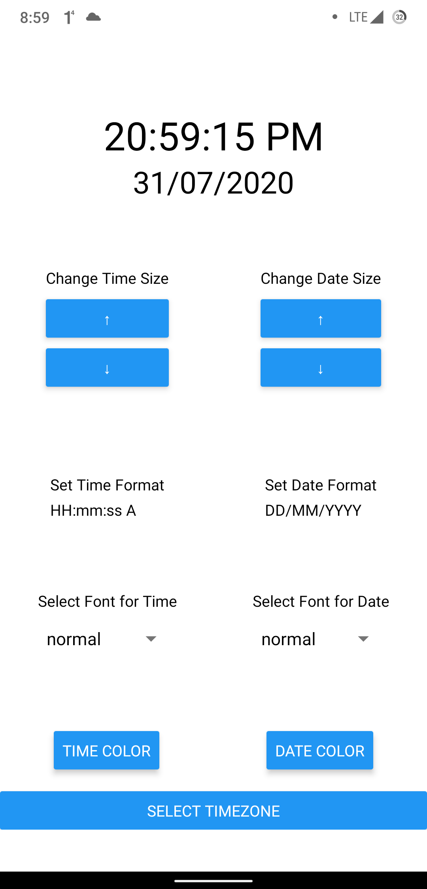
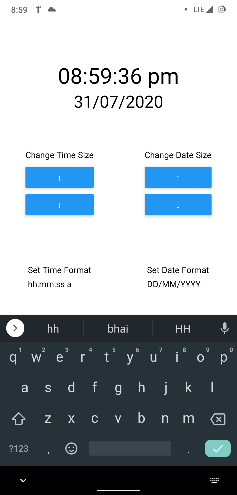
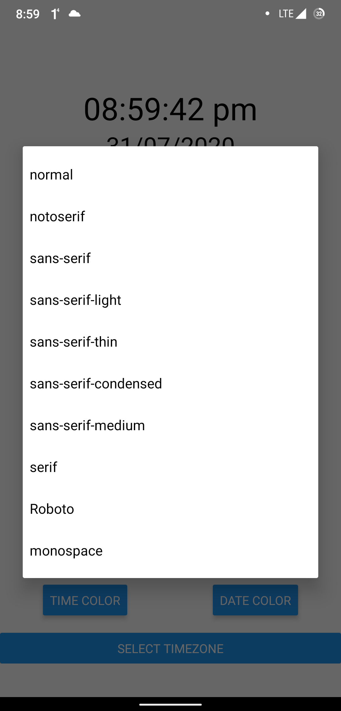
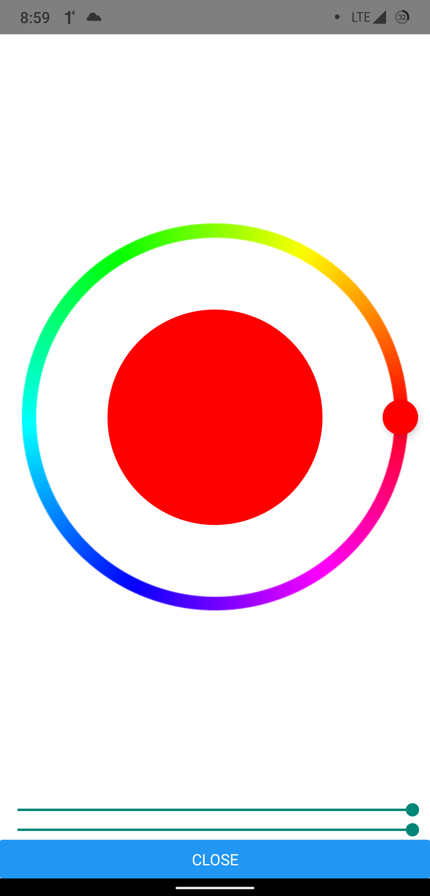
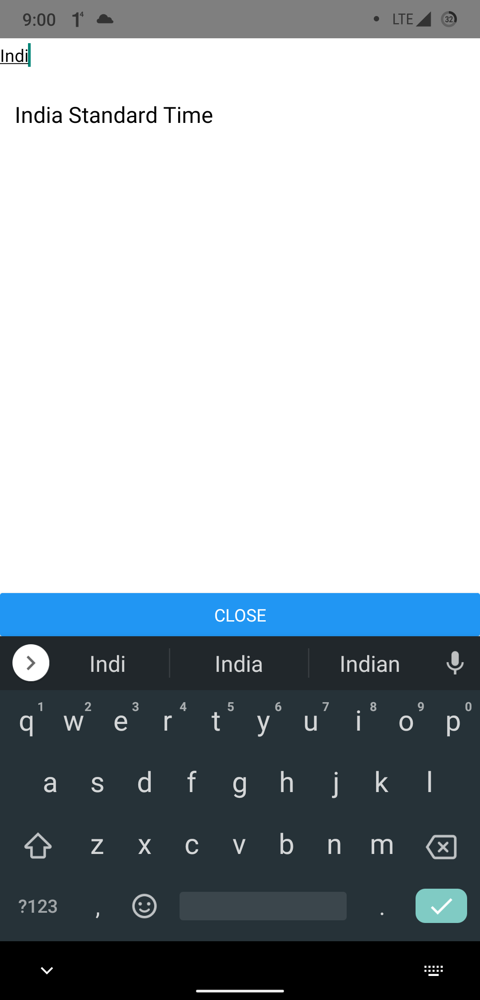

# Clock App
A simple clock app that can show users their current date & time.

This app is based on [Expo CLI Quickstart](https://reactnative.dev/docs/environment-setup)

|  |  |  |
|----------------------------------------------------------------------|----------------------------------------------------------------------|----------------------------------------------------------------------|
|  |  |

## Features

* A user can specify the format he/she wants the date and time to display. (Click on the link above to go to the formatting page)
* A user can select custom timezone.
* A user can change the fontsize of the date and time.
* A user can change the fontFamily of the date and time.
* A user can pick a color for the date and time.

## Sketch of the App


### Testing Instruction

##### To start a Development Server
```shell
npm install
npm start
```
##### To run tests
```shell
npm run test
```
##### To run eslint
```shell
npm run lint
```

### Components Tree


